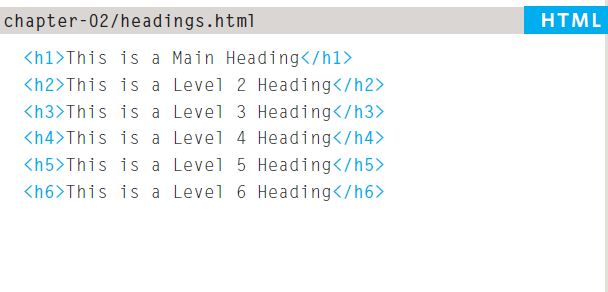
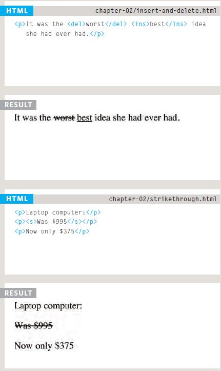
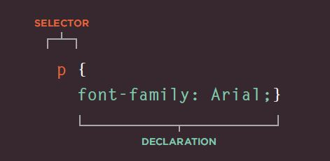

# Basics of HTML, CSS & JS

## TEXT

When creating a web page, you add tags (known as markup) to the contents of the page. These tags provide extra meaning and allow browsers to show users the appropriate structure for the page. There are two differet types of markups:

* **Structural markup:** the elements that you can use to describe both headings and paragraphs

* **Semantic markup:** which provides extra information; such as where emphasis is placed in a sentence, that something you have written is a quotation (and who said it), the meaning of acronyms, and so on

### Headings

HTML has six "levels" of headings: `<h1>` is used for main headings `<h2>` is used for subheadings If there are further sections under the subheadings then the `<h3>` element is used, and so on...

### Paragraph

To create a paragraph, surround the words that make up the paragraph with an opening `
` tag and closing `
` tag.

### Line Breaks & Horizontal Rules

* **` `**: if you wanted to add a line break inside the middle of a paragraph you can use the line break tag ` `.

* **`
`** : To create a break between themes — such as a change of topic in a book or a new scene in a play — you can add a horizontal rule between sections using the `
` tag.

### Strong & Emphasis

The use of the`<strong>` element indicates that its content has strong importance. For example, the words contained in this element might be said with strong emphasis.

By default, browsers will show the contents of a`<strong>` element in bold.

### Citations

When you are referencing a piece of work such as a book, film or research paper, the `<cite>` element can be used to indicate where the citation is from.

### Changes to Content

The `<ins>` element can be used to show content that has been inserted into a document, while the `<del>` element can show text that has been deleted from it.

The content of a `<ins>` element is usually underlined, while the content of a`<del>` element usually has a line through it.

The `<s>` element indicates something that is no longer accurate or relevant (but that should not be deleted).

Visually the content of an `<s>` element will usually be displayed with a line through the center.

## CSS

CSS allows you to create rules that specify how the content of an element should appear. For example, you can specify that the background of the page is cream, all paragraphs should  appear in gray using the Arial typeface, or that all level one headings should be in a blue, italic, Times typeface. To do this you need to select the element you want to apply changes on it and then declare these changes, for example:

as shown in the image the declaration sits inside two brackets and each is made from two parts; a **property** and a **value**.
The property here is the font-family and value 'Arial'.

You can use CSS in HTML in three ways:

1. External link: by creating and seprate file for the CSS styling and then link this file to the HTML by using `<link>` element in the head tag

2. Internal link: by doing the CSS style in the same file in head tag.

3. Inline : by applying the desired modifications on each element in HTML by writing `style` in the opening tag of the element.

### CSS Selectors

There are many different types of CSS selector that allow you to target rules to specific elements in an HTML document. The table bellow shows these types:

